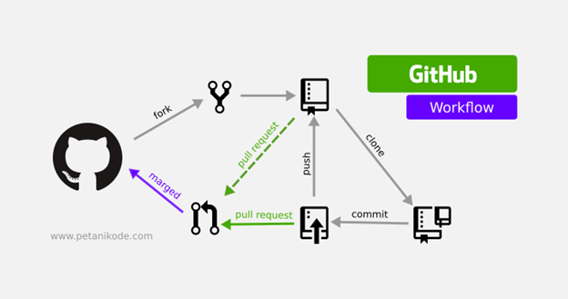
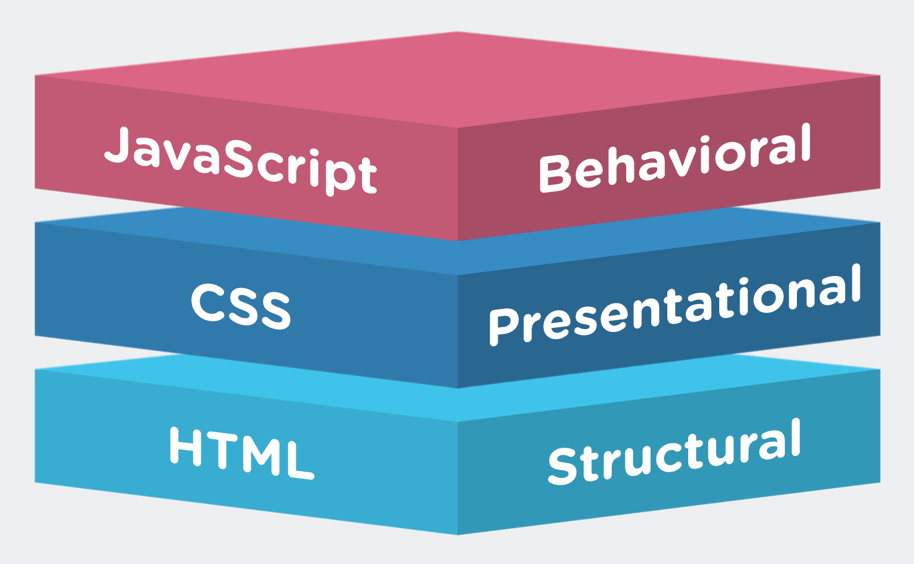
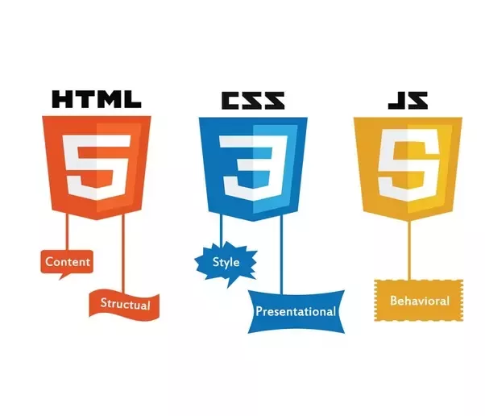

# Poor Man's Guide to NFT Development

Here I will basically write all the material I have for my class.
Hopefully including some diagrams and other things, to make it as visually pleasing as possible.


that's so cool, I just saw someone code like NFT giftcards the other day, like you could redeem exactly 5 ethereum on like a different chain and that is dope as fuck.

Yeah also I would rather use thirdweb instead of Opensea so that's a thing.

I also have to walk them through what is Github.

I have to clear a few things out of the way and things.


I also have to try and get a feel for the audience.


Also I have to walk them through why I was trying the AI things that I was trying.

Scraping Deekay's all walks using Foundation's API

using more Python to further clean up certain things, what I found a lot of inconsistencies in and that it sucked for the most part.

### dangers

I'll also have to tell them the dangers of having to develop and things like that. the first thing is when it comes to web3 please don't look down on tech jobs like, all it takes is a youtube video and you'll be good, it doesn't take too much to understand and things.

I totally agree and I stand for free education. But something's aren't meant to be dealt with unless you know exactly what you're doing especially in blockchain

one wrong transaction posting is all it takes because the testnets are completely different from the mainnets you have MEV overlords and bots that copy transactions that have monetary gain and things. like holy shit. people will front run your transactions if it is not valid.

so please have someone to guide you and take security practices seriously. You do not want to be another slope company for solana that stores their passwords in goddamn plain text.

### 1. Github

  


### Minting Website
Teach them a little about web dev.
What it means to have a small localhost sorta thing

I can try and deploy this static website that uses js and things.

about different frameworks, and other things.

#### javascript is a funny language

javascript is a funny little language

I can also give the the differences in the kinda things they might have to learn.

might show them the actual example
javascript is that one quirky cousin you can't quite tell why, but the whole family relies on them.

```js
5 == '5'
```

```js
var a = NaN
let b = NaN

a==b
a===b
```

so even if they're both NaN you can't really equate them that's weird.
you have to use a method and things.

ask them to start out in python giving them the reason that you're a visual person and it took a long time for me to see what code really could do before I truly understood its potential.

#### Javascript Frameworks
explain them the tools that go along with this.

Not to mention some sorta graphics for them to visually understand.


  
  

### 2. thirdweb

> a platform that provides a suite of tools for creators, artists, and entrepreneurs to easily build, launch and manage a Web3 project

you can easily manage a drop with all the requirements you need without even having to consult any code whatsoever.

gotta choose the NFT drop section

after reveal however can you predict the unminted ones?

they have a dope section for gas prices

[thirdweb gas estimator](https://thirdweb.com/gas)
can change between usd and eth and things.

thirdweb is actually down lmao? wth nah nvm

They also have an SDK, now if you ask me what an SDK is
software development kit, now ik fancy word
> **software-building tools** for a specific platform, including the building blocks, debuggers and, often, a framework or group of **code libraries** and a **set of routines**

### Token Standards
ERC - 1155 is a superior token standard. For comparison Let's walk is an ERC - 1155 which is given right there.

that's why its able to have editions

There's also this special [ERC-721A](https://portal.thirdweb.com/pre-built-contracts/signature-drop)
signature based minting

> Allow users that meet certain criteria to be able to claim NFTs

but okay that aside

I'm sure y'all are familiar with the term **Lazy Minting**?
if this did not exist making those 10,000k collections would be a pain in the ass.

Because you'd have to mint all of them upfront and that would immediately ruin your wallet.

It also helps with liquidity and that the artist can then decide to limit the total collection number to help the holders as well, by 

I'm not too familiar with these, so I don't want to make false promises or talk about things that I don't understand. But what I do understand is the web2 skill and how you can integrate and things.

You can even create your own marketplace on thirdweb however I haven't tried myself.

I need to somehow record myself and also convert it into some sorta uhh blog of sorts? 


### art scraping.

at first I was thinking if I could create an AI generated artwork because that would be dope. so I started scraping for deekay's let's walks. But I realized that it wasn't as easy as I had made it out to be.

I had to resort to a custom python script that checked for existing let's walks on rarible.

but then I ran into lot's of limitations

PIL wasn't as robust as I had made it out to be.

I eventually settled on making my own assets, and things.

We could make a tiny raffle on who get's it? idk bro how else am I going to distribute this?

also should
**live demonstrate** giving away the NFTs

And throughout this process you'll have a lot of questions, such as how to install this, how to configure that, oh god can I have the strength to see through, this. you'll discover what imposter syndrome means, and after all this you'll make it, because there is always a way to do things.

